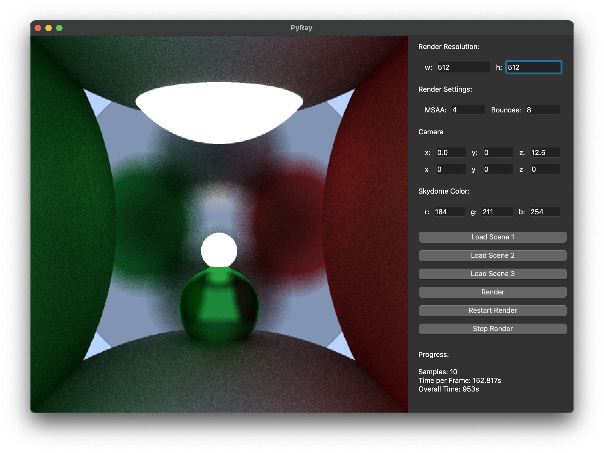
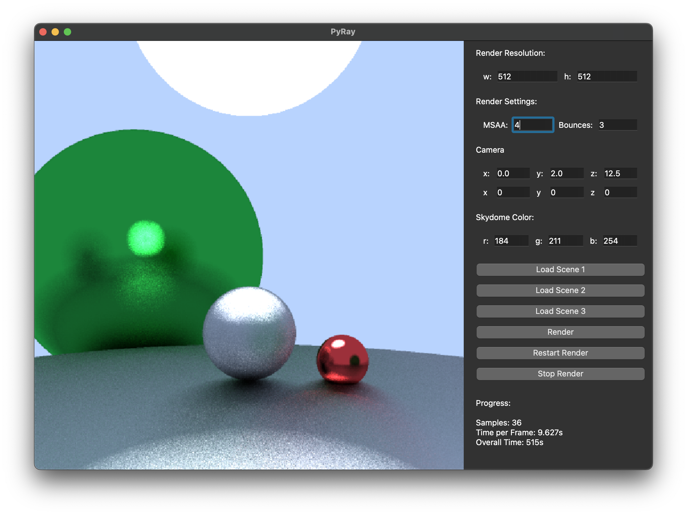

# Python Pathtracer - PyRay




This is a Python pathtracer that supports the following features:

- Sphere intersections
- Material roughness
- Multi-sample antialiasing
- Using PySide6

## Installation

The project is managed with Poetry and based on Python 3.11.2.

1. Clone the repository: <br>
```git clone https://github.com/Design0r/PyRay.git```

2. Install the required dependencies: <br>
```poetry install```

## Usage

To use the pathtracer, run the following command:

```poetry run python pyray/main.py```

